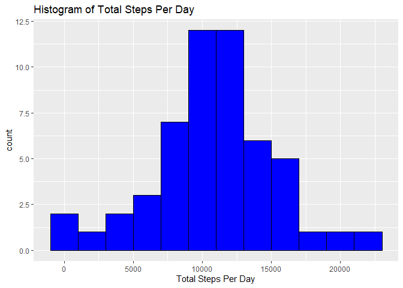
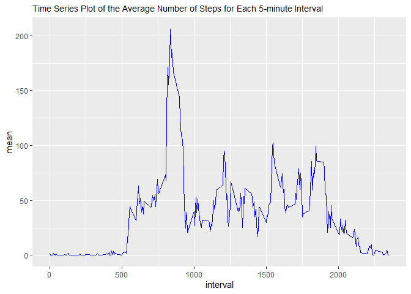
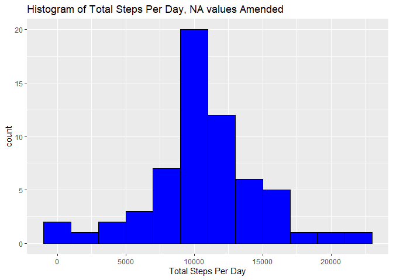
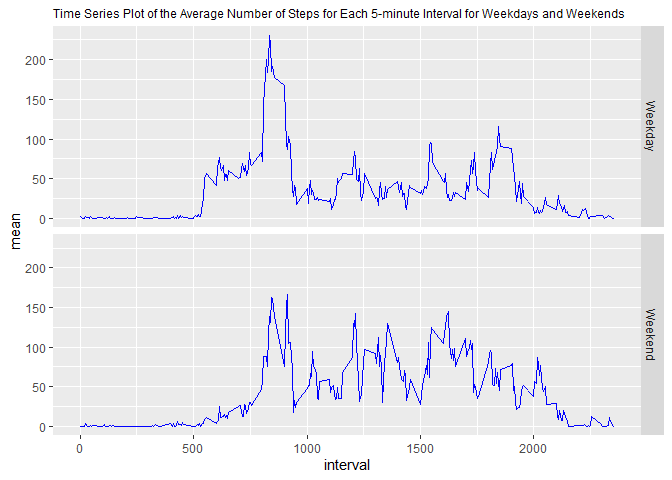

## Loading and preprocessing the data
I will load the data by first downloading the zip file from the URL, then unzipping, and then storing in the object `data`. 

```r
URL <- "https://d396qusza40orc.cloudfront.net/repdata%2Fdata%2Factivity.zip"
download.file(URL, "./repdata%2Fdata%2Factivity.zip")
unzip("./repdata%2Fdata%2Factivity.zip", exdir = ".")
data <- read.csv("./activity.csv")
```

## What is mean total number of steps taken per day?
I will calculate the total number of steps taken per day, first loading `tidyverse` so that `ggplot` can be used and also removing na values.

```r
library(tidyverse)
```

```r
total_steps <- data %>% 
  group_by(date) %>% 
  summarise(total_steps_per_day = sum(steps)) %>%
  .[!is.na(.$total_steps_per_day),] %>%
  print(n = Inf)
```

```
## # A tibble: 53 x 2
##    date       total_steps_per_day
##    <fct>                    <int>
##  1 2012-10-02                 126
##  2 2012-10-03               11352
##  3 2012-10-04               12116
##  4 2012-10-05               13294
##  5 2012-10-06               15420
##  6 2012-10-07               11015
##  7 2012-10-09               12811
##  8 2012-10-10                9900
##  9 2012-10-11               10304
## 10 2012-10-12               17382
## 11 2012-10-13               12426
## 12 2012-10-14               15098
## 13 2012-10-15               10139
## 14 2012-10-16               15084
## 15 2012-10-17               13452
## 16 2012-10-18               10056
## 17 2012-10-19               11829
## 18 2012-10-20               10395
## 19 2012-10-21                8821
## 20 2012-10-22               13460
## 21 2012-10-23                8918
## 22 2012-10-24                8355
## 23 2012-10-25                2492
## 24 2012-10-26                6778
## 25 2012-10-27               10119
## 26 2012-10-28               11458
## 27 2012-10-29                5018
## 28 2012-10-30                9819
## 29 2012-10-31               15414
## 30 2012-11-02               10600
## 31 2012-11-03               10571
## 32 2012-11-05               10439
## 33 2012-11-06                8334
## 34 2012-11-07               12883
## 35 2012-11-08                3219
## 36 2012-11-11               12608
## 37 2012-11-12               10765
## 38 2012-11-13                7336
## 39 2012-11-15                  41
## 40 2012-11-16                5441
## 41 2012-11-17               14339
## 42 2012-11-18               15110
## 43 2012-11-19                8841
## 44 2012-11-20                4472
## 45 2012-11-21               12787
## 46 2012-11-22               20427
## 47 2012-11-23               21194
## 48 2012-11-24               14478
## 49 2012-11-25               11834
## 50 2012-11-26               11162
## 51 2012-11-27               13646
## 52 2012-11-28               10183
## 53 2012-11-29                7047
```

I will print a histogram of the total steps per day.

```r
total_steps %>%
  ggplot(aes(total_steps_per_day)) +
  geom_histogram(binwidth = 2000, col = "black", fill = "blue") + 
  ggtitle("Histogram of Total Steps Per Day") +
  xlab("Total Steps Per Day")
```

<!-- -->

I will print the mean and median, converting to a data frame in the final step to show the true mean without rounding.

```r
total_steps %>% summarise(mean = mean(total_steps_per_day), median = median(total_steps_per_day)) %>%
  as.data.frame()
```

```
##       mean median
## 1 10766.19  10765
```

## What is the average daily activity pattern?
I will create a time series plot of the average daily steps taken per 5 minute time interval, first creating the object `average_steps` to be used both now and later, then removing na values in calculating the mean, and finally plotting with an adjustment to the title font size.

```r
average_steps <- data %>% 
  group_by(interval) %>%
  summarise(mean = mean(steps, na.rm = TRUE))
average_steps %>% ggplot(aes(interval, mean)) +
  geom_line(col = "blue") +
  ggtitle("Time Series Plot of the Average Number of Steps for Each 5-minute Interval") +
  theme(plot.title = element_text(size=10.5))
```

<!-- -->

Next, I will use the `average_steps` object to print the interval with the maximum average. 

```r
average_steps %>% .[which.max(.$mean),] %>%
  .$interval
```

```
## [1] 835
```

## Imputing missing values
I will print the total number of missing values.

```r
sum(is.na(data))
```

```
## [1] 2304
```

I will replace all missing values with the average value (across all dates) for that interval. I have already stored these average values in the object `average_steps`. I will then create a new data set, stored as `data2`, where I merge with the averages, replace the missing values and reorder the columns so as to obtain a dataset in the same form as the original dataset, `data`.

```r
merged_data <- merge(data, average_steps)
merged_data$steps[is.na(merged_data$steps)] <- merged_data$mean[is.na(merged_data$steps)]
data2 <- merged_data[order(merged_data$date),]
data2 <- data2[,c(2,3,1)]
```

I will repeat the process of my answer to the first question for `data2`. First, the table.

```r
total_steps2 <- data2 %>% 
  group_by(date) %>% 
  summarise(total_steps_per_day = sum(steps)) %>%
  print(n = Inf)
```

```
## # A tibble: 61 x 2
##    date       total_steps_per_day
##    <fct>                    <dbl>
##  1 2012-10-01              10766.
##  2 2012-10-02                126 
##  3 2012-10-03              11352 
##  4 2012-10-04              12116 
##  5 2012-10-05              13294 
##  6 2012-10-06              15420 
##  7 2012-10-07              11015 
##  8 2012-10-08              10766.
##  9 2012-10-09              12811 
## 10 2012-10-10               9900 
## 11 2012-10-11              10304 
## 12 2012-10-12              17382 
## 13 2012-10-13              12426 
## 14 2012-10-14              15098 
## 15 2012-10-15              10139 
## 16 2012-10-16              15084 
## 17 2012-10-17              13452 
## 18 2012-10-18              10056 
## 19 2012-10-19              11829 
## 20 2012-10-20              10395 
## 21 2012-10-21               8821 
## 22 2012-10-22              13460 
## 23 2012-10-23               8918 
## 24 2012-10-24               8355 
## 25 2012-10-25               2492 
## 26 2012-10-26               6778 
## 27 2012-10-27              10119 
## 28 2012-10-28              11458 
## 29 2012-10-29               5018 
## 30 2012-10-30               9819 
## 31 2012-10-31              15414 
## 32 2012-11-01              10766.
## 33 2012-11-02              10600 
## 34 2012-11-03              10571 
## 35 2012-11-04              10766.
## 36 2012-11-05              10439 
## 37 2012-11-06               8334 
## 38 2012-11-07              12883 
## 39 2012-11-08               3219 
## 40 2012-11-09              10766.
## 41 2012-11-10              10766.
## 42 2012-11-11              12608 
## 43 2012-11-12              10765 
## 44 2012-11-13               7336 
## 45 2012-11-14              10766.
## 46 2012-11-15                 41 
## 47 2012-11-16               5441 
## 48 2012-11-17              14339 
## 49 2012-11-18              15110 
## 50 2012-11-19               8841 
## 51 2012-11-20               4472 
## 52 2012-11-21              12787 
## 53 2012-11-22              20427 
## 54 2012-11-23              21194 
## 55 2012-11-24              14478 
## 56 2012-11-25              11834 
## 57 2012-11-26              11162 
## 58 2012-11-27              13646 
## 59 2012-11-28              10183 
## 60 2012-11-29               7047 
## 61 2012-11-30              10766.
```

Second, the histogram.

```r
total_steps2 %>%
  ggplot(aes(total_steps_per_day)) +
  geom_histogram(binwidth = 2000, col = "black", fill = "blue") + 
  ggtitle("Histogram of Total Steps Per Day, NA values Amended") +
  xlab("Total Steps Per Day")
```

<!-- -->

Finally, the mean and median.

```r
total_steps2 %>% summarise(mean = mean(total_steps_per_day), median = median(total_steps_per_day)) %>%
  as.data.frame()
```

```
##       mean   median
## 1 10766.19 10766.19
```
Imputing the missing values has caused no change in the mean but a slight increase in the median- it is in fact now the same as the mean.

## Are there differences in activity patterns between weekdays and weekends?
I will add a column to `data2` indicating whether the day was a weekday or a weekend day by first converting the date variable to date format and then adding it to create a new object `data3`.

```r
data2$date <- as.Date(data2$date, format = "%Y-%m-%d")
data3 <- data2 %>% mutate(Type_of_Day = ifelse(weekdays(date) == "Saturday" | weekdays(date) == "Sunday", "Weekend", "Weekday"))
```

I will finally make a panel plot by amending the code written for the second question.

```r
average_steps3 <- data3 %>% 
  group_by(interval, Type_of_Day) %>%
  summarise(mean = mean(steps, na.rm = TRUE))
average_steps3 %>% ggplot(aes(interval, mean)) +
  geom_line(col = "blue") +
  ggtitle("Time Series Plot of the Average Number of Steps for Each 5-minute Interval for Weekdays and Weekends") +
  theme(plot.title = element_text(size=9)) +
  facet_grid(Type_of_Day ~ .)
```

<!-- -->
